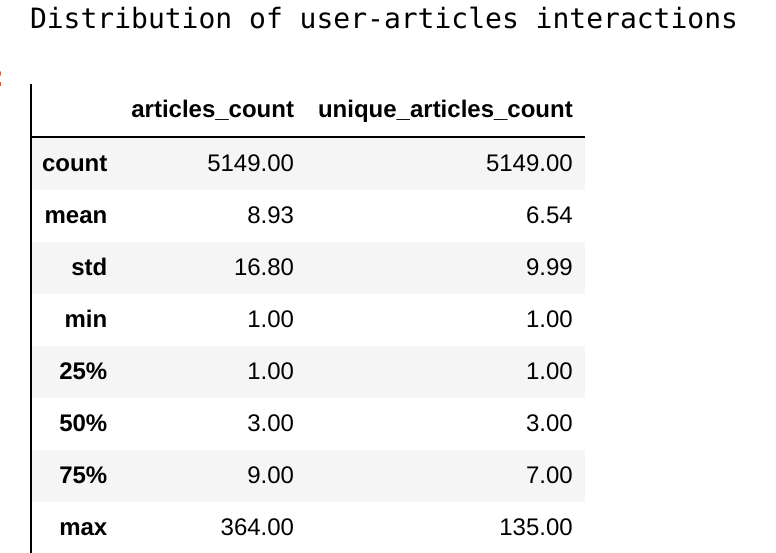
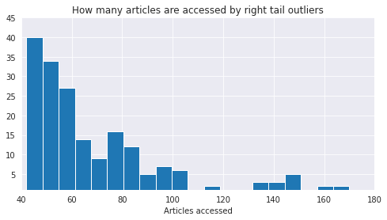
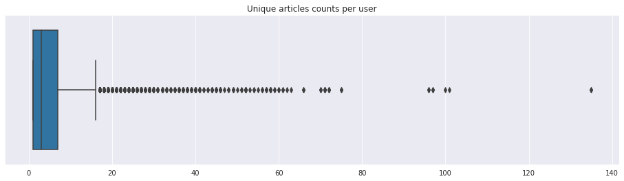
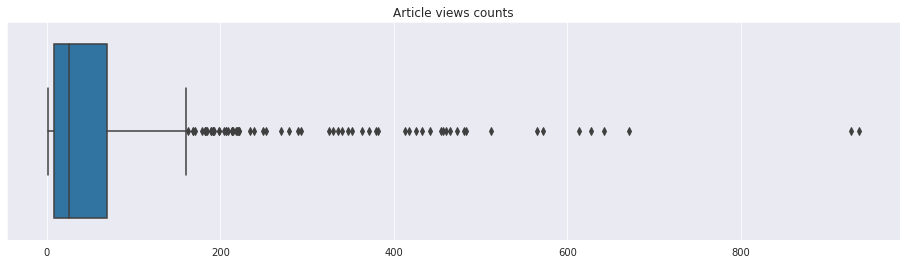

## Data Description and Exploration

The raw data is provided by the online learning platform Udacity, through the data scientist nanodegree program, and it is based on real data from IBM Watson Studio platform. There are two datafiles wich are described below.

##### `use-item-interactions.csv`
This corresponds to a dataframe with 3 columns: `article_id`, `title`, `email`. There are $45993$ records in this dataframe which represent unique interactions user-article.

The following steps are taken to preprocess the dataframe:

- the `email` column is parsed through an email mapper function, and replaced by an `user_id` column. There are $5148$ unique users. The $17$ records with missing email are attributed to a generic user.

 ##### `articles-community.csv`
 This file corresponds to a dataframe with 5 columns: `doc_body`, `doc_description`, `doc_full_name`, `doc_status` and `article_id`. There are $1056$ records in this dataframe.

The following steps are taken to preprocess the dataframe:

- the $5$ duplicates are removed.

&nbsp;

#### Analysis of the user based interactions data

There are $5148$ unique users that access $714$ distinct articles.

 

&nbsp;
A few more details on how the users in this datset accessed various (not necessarily distinct) articles on the platform:

  - $50\%$ of individuals interact with $3$ or fewer articles;
  - $1416$ users accessed one article each;
  - the maximum number of (not neccessarily distinct) articles accessed by a user is $364$;
  - there are $190$ users who accessed at least $42$ articles each - see plot below:

 

The distribution of user with distinct articles is given in the boxplot below:

- There are $8$ users who accessed $80$ articles or more;
- The largest number of distinct articles accessed by a user is $135$.

Usually a user interacts once with a given article, most of the users ( $98.84 \%$ to be precise) have at most $5$ interactions with a given article. The largest number of times a user interacted with a single article is $42$, but this is an isolated case.

&nbsp;
#### Analysis of the article based interactions data

The dataset `articles_community.csv` contains $1051$ unique articles. On the other side, there are $714$ articles in the user-item interactions dataset, these correspond to articles that were accessed at least once by a user in our dataset. However, the set of accessed articles contains titles that are not in the `articles_community.csv` dataset.

Regarding the distribution of the number of views an article receives:

- $50 \%$ of articles are viewed $25$ times and $75\%$ of articles are viewed $69$ times;
- the two most popular articles received more than $920$ views each.

&nbsp;
## Feature Engineering

Two new dataframes are created.

- `articles_per_users` is centered on the user activity, contains the following columns:
  - `user_id` - parsed from the `email` column;
  - `viewed_articles` - a list of article ids accessed by the user, including duplicates if an article was accessed more than once;
  - `articles_count` - the count of interactions, including duplicates;
  - `unique_articles_count` - the number of unique articles accessed by the user.

All the article titles are collected in a single dataset that contains both accessed articles and also the articles on the platform that were not viewed by the users in the dataset.

- `users_per_article` is centered on the article data, contains the following columns:
  - `doc_body` - the full text of the article;
  - `doc_description` - short abstract of the article;
  - `article_id` - article unique identifier;
  - `views` - the number of times an article is accessed;
  - `doc_name` - the title of the article;
  - `users_accessed` - a list of the users (including duplicates) that viewed the article.
